# To-do-List
Sistema de gestão de suas tarefas desenvolvido em React e Node JS.  

#### Tela inicial
    

To-do List é uma plataforma web para gerenciar suas tarefas, podendo ser exibidas de acordo com suas categorias (pendentes e concluídas). Se você já é registrado, poderá efetuar seu login.  

#### Login  
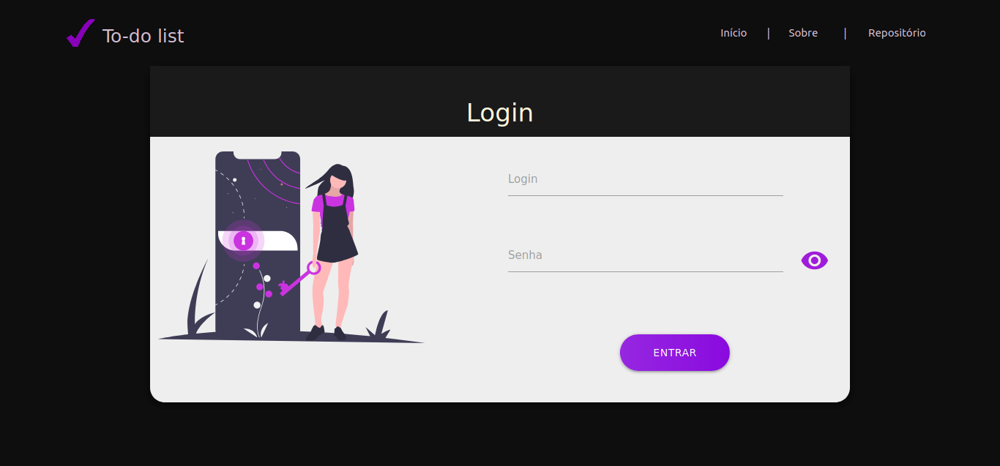  

Caso não seja registrado, poderá se cadastrar digitando os dados solicitados na tela de cadastro.  

#### Cadastro  
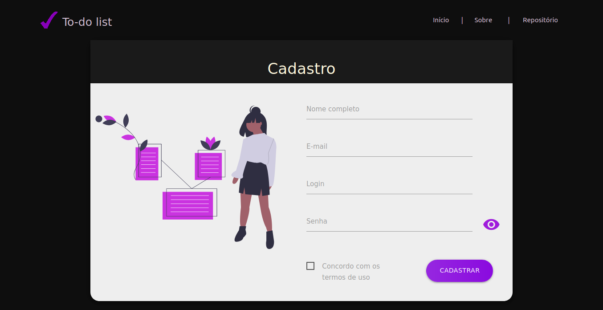  

Ao se cadastrar você será redirecionado para a pagina principal, onde encontrará uma interface que é possível visualizar suas tarefas inseridas, cadastrar uma nova e gerenciar as mesmas.  

#### Página principal  
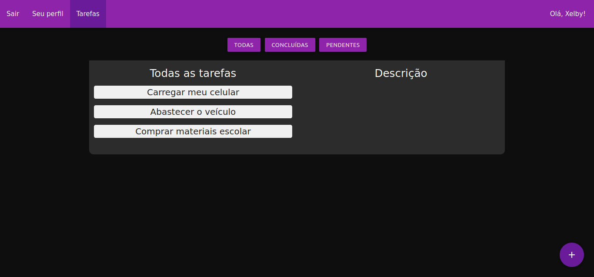  

Ao clicar no botão de adicionar ua nova tarefa localizado no canto inferior direito um modal abrirá e será possível cadastrar uma nova tarefa.  
Ao clicar em uma tarefa é possível visualizar sua descrição e as ações que é possível executar com as tarefas.  

#### Descrição  
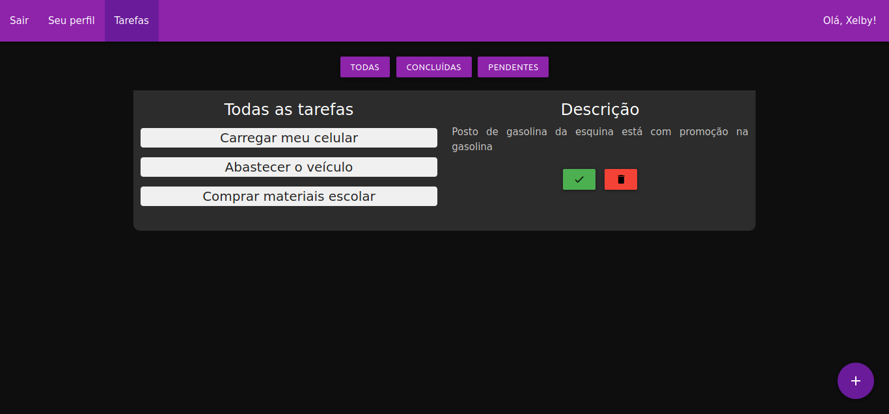  

Quando uma tarefa é dita como concluída é possivel vê-la na aba de tarefas concluídas, e com as pendentes acontece a mesma coisa.  

#### Aba de tarefas concluídas  
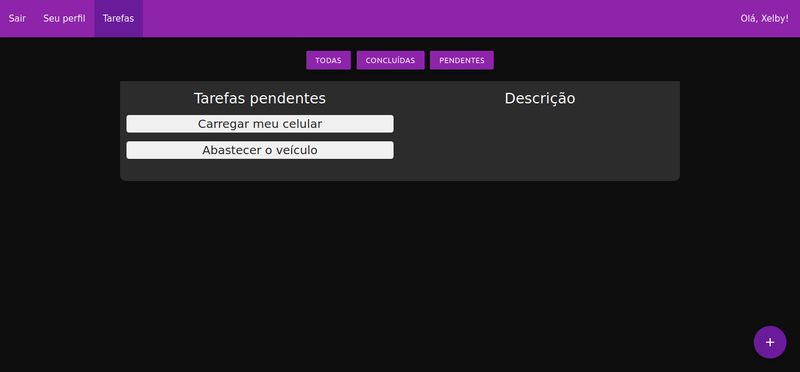  

Além disso, é possível gerenciar e visualizar seu perfil e informações como login, email e trocar sua senha.  

#### Perfil  
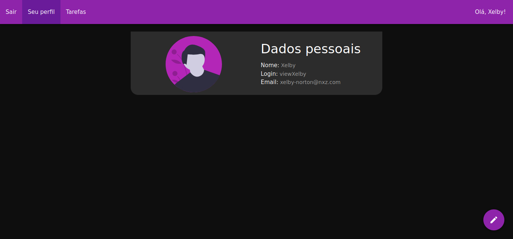  

Ao clicar no botão de editar localizado no canto inferior direito é possível editar suas informações. Clicando em uma das opções irá abrir um modal onde será possível editar seus dados.  

#### Editar dados  
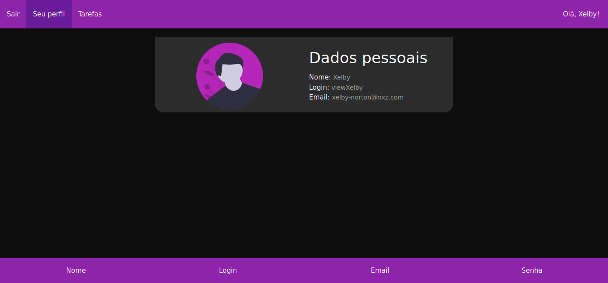  

Abaixo estará todas as telas de forma responsiva. Qualquer sugestão, tanto de código como de design será bem vinda :D  

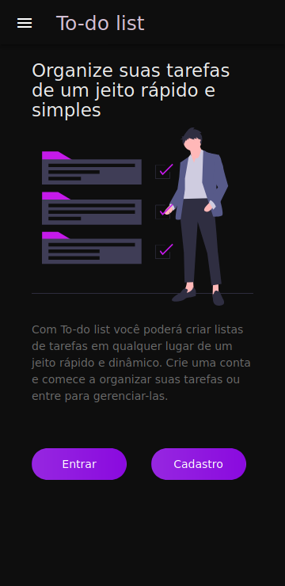  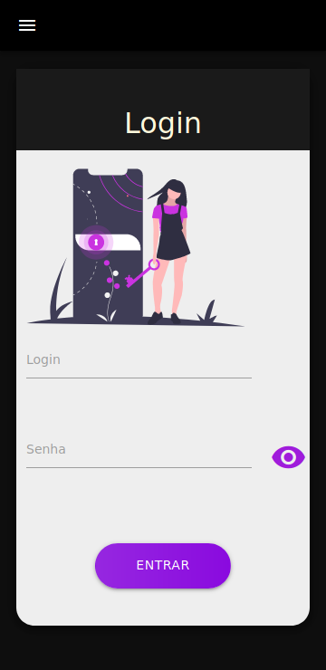 

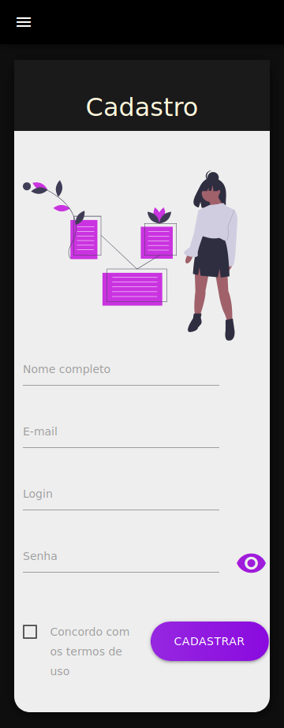  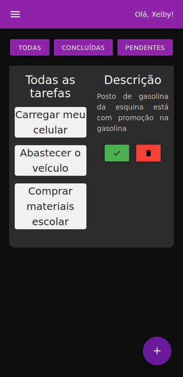  

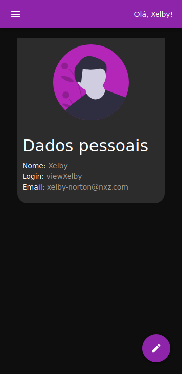  

